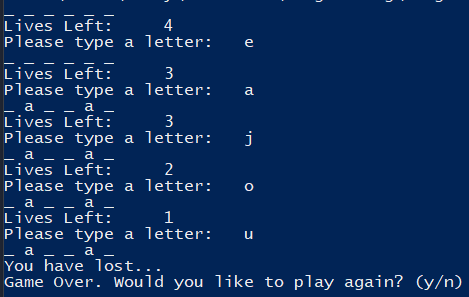

# Hangman Overview

This program is a java program meant to simulate the game hangman. The player plays against the computer. The computer randomly selects a word from one of the many words that it has preprogrammed as an option. It then asks the user for a letter, and if the letter that the user provides is a letter that is within the word, it displays it, else it reduces one life from the players pool. The game ends when the player runs out of lives or when the player successfully guesses the word.

## Screenshot of the Gameplay
